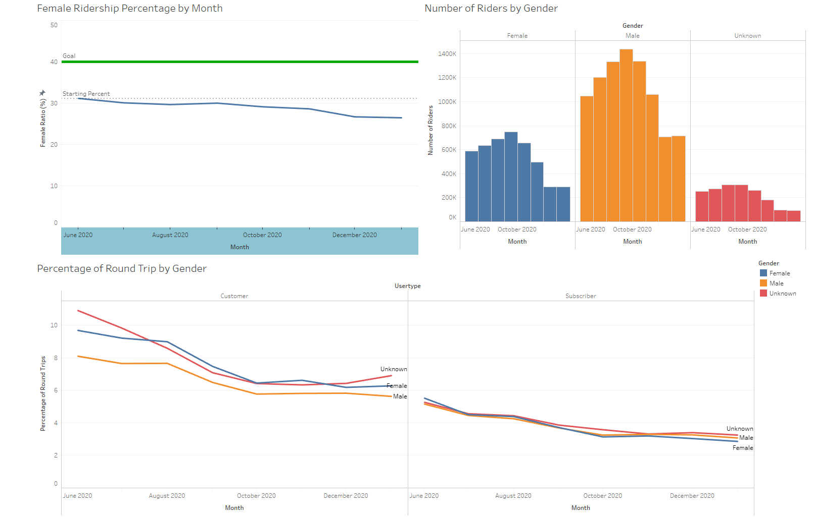

# Tableau Challenge - Citibike Dashboard

## Summary

The link to the dashboards and visualizations on Tableau Public is <https://public.tableau.com/profile/joe.kell7438#!/vizhome/CitibikeDashboard_16137976314640/SeasonalityDashboard>

In this project I am building dashboards and other visualizations using Tableau to relay information about the Citi Bike data from New York City.

## Tools
These are the tools, techniques, and resources used in this project.

* Tableau is used for creating dashboards and other auxillary visuals

* Jupyter Notebook is used to combine the data into one file

### About the Data

Since 2013, the Citi Bike Program has implemented a robust infrastructure for collecting data on the program's utilization. Through the team's efforts, each month bike data is collected, organized, and made public on the [Citi Bike Data](https://www.citibikenyc.com/system-data) webpage.

My visualizations use data from June 2020 through January 2021, during which time the United States was being brutalized by COVID-19.

## Page Details and Writeups

### City Official Map

This visualization shows all bike stations used between June 2020 and January 2021. The more popular a station is, the darker the shade of purple for the corresponding circle is a darker shade of purple. Zip codes are colored a shade of grey depending on the 2018 Average Household Size from the US Census. Users are able to use the sliding Date Range selecter to look at more specific date ranges and there is also an option to filter the data by season.

The main trend that is apperent in this visual is that the bike stations in Manhattan are the most popular.

### Female Ridership Dashboard

The purpose of this dashboard is to explore the effectiveness of Citi Bike's most recent marketing campaign aimed at increasing the percentage of female riders across the platform. Since this is the primary focus, the first visual seen (upper left) shows the progress towards the goal.

The next visual (upper right) is a bar chart showing the total number of riders for each gender by month.

The visual along the bottom gives an idea of what people are using the bikes for. Typically when someone makes a "round trip" - meaning they start and end at the same station - they are using the bike for exercise. This visual looks at the percentage of trips that were round trips broken down by gender and user type.

The concerning message is that the campaign intended to increase female ridership has actually decreased it.

### Seasonal Use Dashboard

The first visual (Top Left) shows the distribution of riders by age in each season. This does not seem to change much even when filtering by hour of day, which was quite surprising to me.

The map (Top Right) shows the top 25 stations and allows users to look at the plots for those stations when selected.

The line charts on the bottom show an hourly breakdown by weekday and weekend of the number of riders each season and the average trip length each season.

The most interesting thing that comes from these charts is the peak at 4am on summer weekends for average trip length. This is very likely people biking home from the bars since last call is 4am in New York City.